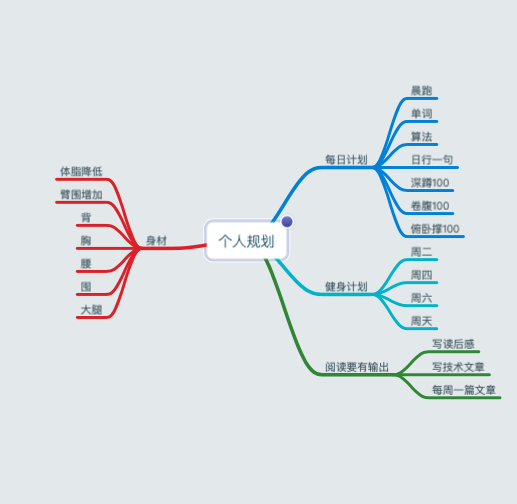

# 2020-第一周

> 过去的2019，自己略显得颓废，第一周好好整理一下，做出了新的一年的各方面的规划，或许说不是很完善，至少应该是大方向的。

## 后端

把这个作为第一个提出来，是因为一直想要涉足后端，今年才开始正式提上日程，主要是根据公司的新员工学习计划然后根据自己的情况来进行制定的。

## 前端

前端的话，主要是React的继续深入，业务代码的继续熟悉，还有就是微前端的搭建，主要是借助`ant-design`一些成熟的方法。

## 个人

个人的计划放到了最后，是持续不断的学习：无所畏惧，有所敬畏，认真生活，努力工作。

